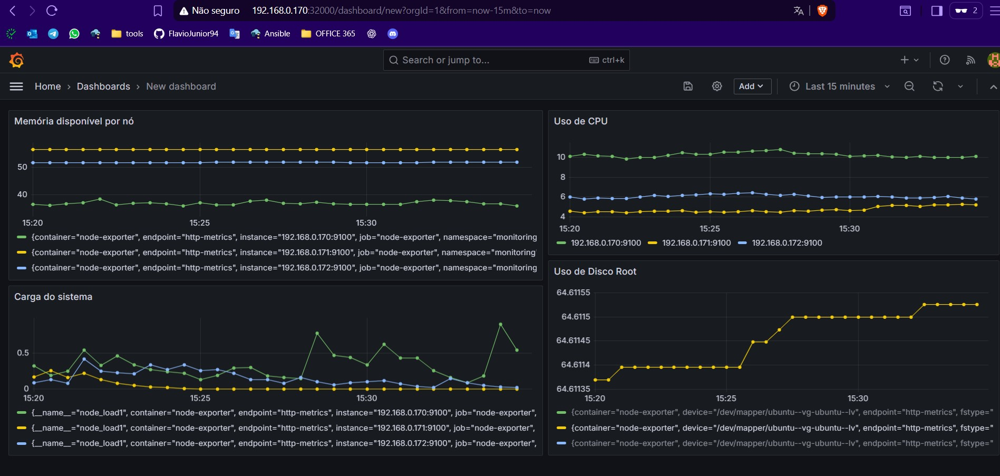
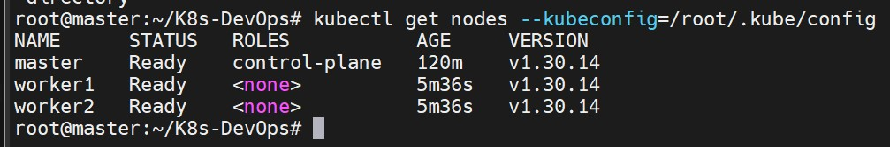
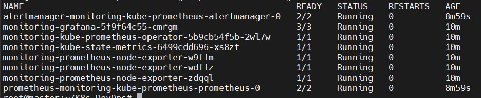

# 🚀 Projeto DevOps – Kubernetes com Ansible

[](https://www.ansible.com/)  
[](https://kubernetes.io/)  
[](https://www.docker.com/)  
[](https://github.com/FlavioJunior94/K8s-DevOps)

Este projeto tem como objetivo provisionar automaticamente um **cluster Kubernetes** usando **Ansible**, aplicando conceitos de **Infraestrutura como Código (IaC)**, **DevOps** e **automação**.

Atualmente o projeto instala e configura:  
- 🐧 **Linux (Ubuntu 22.04)** como base do cluster  
- 🐳 **Container runtime (containerd)**  
- ☸️ **Kubernetes (kubeadm, kubelet, kubectl)**  
- 🔗 **Cluster com 1 master e múltiplos workers**  
- 📦 **Helm** (gerenciador de pacotes para K8s)  
- 📊 **Monitoramento (Prometheus + Grafana)**  
- 🔄 **Auto-recovery e auto-rejoin**

---



## 📂 Estrutura do Projeto

```bash
K8s-DevOps/
├── ansible-docker/               # Projeto para instalação do Docker
│   ├── inventory.ini            # Inventário para Docker
│   └── playbook.yml             # Playbook do Docker
├── ansible-k8s/                 # Projeto principal para Kubernetes
│   ├── roles/                   # Roles do Ansible
│   │   ├── ansible-deps/        # Dependências do Ansible
│   │   ├── auto-recover-node/   # Auto-recuperação de nodes
│   │   ├── auto-rejoin-worker/  # Auto-rejoin de workers
│   │   ├── helm/                # Instalação do Helm
│   │   ├── kubernetes/          # Instalação do Kubernetes
│   │   └── monitoring/          # Prometheus e Grafana
│   ├── inventory.ini            # Inventário com IPs dos nodes
│   └── playbook.yml             # Playbook principal
├── clean/                       # Projeto para limpeza completa
│   ├── roles/                   # Roles de limpeza
│   │   ├── clean-k8s/          # Limpeza do Kubernetes
│   │   └── clean-docker/       # Limpeza do Docker
│   ├── inventory.ini            # Inventário para limpeza
│   ├── playbook.yml             # Playbook de limpeza
│   └── README.md                # Documentação da limpeza
├── bootstrap-master.sh          # Script de bootstrap do master
├── bootstrap.sh                 # Script de bootstrap geral
├── Vagrantfile                  # Configuração do Vagrant
├── IMG/                         # Imagens do projeto
└── README.md                    # Este arquivo
```

## ⚙️ Pré-requisitos

- VMs ou servidores rodando Ubuntu 22.04
- Acesso via SSH root (ou usuário sudo configurado no Ansible)
- Ansible instalado na máquina de gerenciamento
- Recursos mínimos recomendados:
  - **Master**: 2 vCPUs, 2 GB RAM, 20 GB disco
  - **Worker**: 1 vCPU, 1 GB RAM, 10 GB disco

## ▶️ Como Usar o Projeto

1. **Clone o repositório:**
```bash
git clone https://github.com/FlavioJunior94/K8s-DevOps.git
cd K8s-DevOps
```

2. **Configure o inventário ansible-k8s/inventory.ini com os IPs das suas VMs:**
```ini
[k8s-master]
192.168.0.24

[k8s-workers]
192.168.0.30
192.168.0.31

[k8s-cluster:children]
k8s-master
k8s-workers
```

3. **Execute o playbook principal:**
```bash
cd ansible-k8s
ansible-playbook -i inventory.ini playbook.yml
```

4. **Verifique o cluster:**
```bash
kubectl get nodes
```

Saída esperada:
```bash
NAME      STATUS   ROLES           AGE   VERSION
master    Ready    control-plane   5m    v1.30.14
worker1   Ready    <none>          3m    v1.30.14
worker2   Ready    <none>          3m    v1.30.14
```



5. **Verifique os pods do sistema:**
```bash
kubectl get pods -n kube-system
kubectl get pods -n monitoring
```

## 🎯 Funcionalidades Implementadas

✅ **Auto-Recovery**: Sistema automático de recuperação de nodes  
✅ **Auto-Rejoin**: Workers se reconectam automaticamente ao cluster  
✅ **Monitoring**: Prometheus e Grafana funcionais  
✅ **CNI**: Weave Net para networking  
✅ **Tags**: Execução seletiva de componentes  
✅ **Limpeza**: Projeto clean para remoção completa  

## 🔧 Comandos Úteis

```bash
# Instalar apenas Docker
cd ansible-docker
ansible-playbook -i inventory.ini playbook.yml

# Instalar cluster completo
cd ansible-k8s
ansible-playbook -i inventory.ini playbook.yml

# Instalar apenas monitoring
ansible-playbook -i inventory.ini playbook.yml --tags monitoring

# Instalar apenas auto-recovery
ansible-playbook -i inventory.ini playbook.yml --tags auto-recover

# Limpar tudo completamente
cd clean
ansible-playbook -i inventory.ini playbook.yml
```

## 📊 Acessos

- **Grafana**: `http://IP_MASTER:30000` (admin/senha_gerada)
- **Prometheus**: `http://IP_MASTER:30001`

## 📝 Próximos Passos

🔐 Adicionar configuração de RBAC e usuários para acesso seguro ao cluster  
☁️ Automatizar deploy de aplicações de exemplo (Nginx, Guestbook, etc.)  
📡 Configurar alertas no Grafana (UP/DOWN de nodes e monitoramento de recursos)  
🧪 Criar pipeline CI/CD integrado (GitHub Actions ou Jenkins)  
📦 Adicionar Storage Provisioner (ex.: rook-ceph ou nfs-provisioner)  
🌐 Incluir Ingress Controller (NGINX Ingress Controller) para gerenciar acessos externos  
🛡️ Configurar Network Policies para segurança entre pods  

## 🚀 Melhorias Futuras

🔧 Automatizar toda a configuração do cluster em cloud providers (AWS, Azure, GCP)  
📜 Criar documentação detalhada para cada role  
🖥️ Adicionar painéis customizados no Grafana com CPU, memória, disco e disponibilidade por node  
📌 Implementar GitOps usando ArgoCD ou FluxCD  

## 👨‍💻 Autor

Projeto desenvolvido por **Flávio Junior**, como estudo e prática em DevOps, Kubernetes e Ansible.